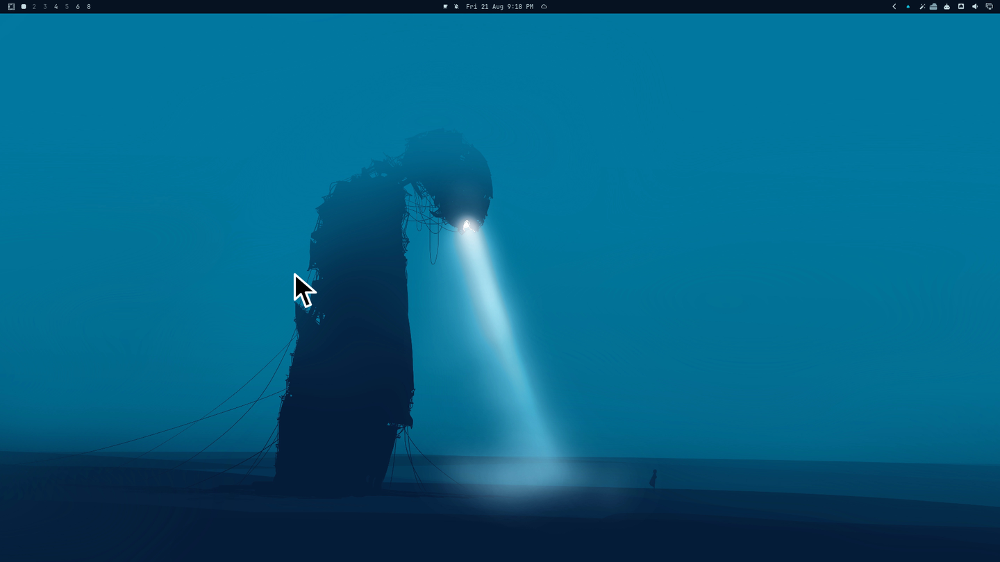

<p align="center">
  
</p>

<h1 align="center">Big Cheese</h1>

<p align="center"><strong>Shake the pointer to make it impossible to lose.</strong></p>

Big Cheese is an Omarchy Shell service and bar-widget plugin inspired by
macOS’s **Shake mouse pointer to locate** accessibility feature. It watches
Hyprland’s global cursor position without intercepting input, recognizes an
intentional rapid left/right shake, and places a crisp 48–72 px pointer at the
exact cursor hotspot for about 2 seconds. The visual overlay follows the live
pointer and never intercepts input.

## Preview

<p align="center">
  
</p>

<p align="center"><em>One sharp pointer, no locate ring, and no doubled cursor.</em></p>

## How it works

- One guarded `hyprctl cursorpos -j` process samples raw global coordinates.
- Polling runs at 110 ms while idle and 55 ms briefly after fast horizontal
  movement arms the detector.
- A deterministic rolling model requires three reversals, sufficient horizontal
  travel, horizontal dominance, contiguous samples, and an expired cooldown.
- One input-transparent layer-shell surface per output is kept mapped while the
  service is enabled. A single sharp vector pointer appears at the sampled
  hotspot, including on monitors with negative origins. At startup, its fill
  and outline are derived from the active Xcursor theme's default arrow, with a
  dark-fill/light-outline fallback. It appears only
  after a successful native-cursor hide, same-position refresh, and short
  compositor-settle delay. On the verified Hyprland version this removes the
  doubled transition frame. There is no locate ring.
- Normal pulses are timer-driven visual overlays and perform zero `setcursor`
  mutations. A guarded helper process owns the temporary compositor mask,
  refreshes client-owned cursor surfaces, and restores the user's prior
  visibility setting even if Quickshell reloads. Native resizing remains only
  as a disabled legacy fallback.
- A compact monochrome cheese icon in the bar provides manual locate and
  enable/disable controls without adding a settings panel.
- Legacy runtime state is private to
  `${XDG_RUNTIME_DIR:-/tmp}/jobo-big-cheese-${UID}/`.

Pointer warps, tiny jitter, vertical motion, a single fast swipe, and ordinary
monitor crossings are guarded against. Negative global coordinates are retained
for layouts whose monitors extend left or above the origin.

## Requirements

- Omarchy Shell with third-party service plugin support
- Hyprland and `hyprctl`
- Font Awesome 7 Free Solid (provided by current Omarchy installations)
- Bash, Python 3, util-linux `flock`, and GNU coreutils (`base64` and `date`)
  for cursor-theme color detection and the short-lived mask/recovery helper
- `gsettings` is optional; it improves legacy fallback baseline discovery

Visual overlay mode waits for its startup recovery check, then becomes ready
without waiting for legacy cursor baseline-size discovery.

## Install

From GitHub (repository access is required while the project is private):

```bash
omarchy plugin add https://github.com/OldJobobo/big-cheese.git --enable --yes
```

For local development, run this from the checkout:

```bash
omarchy plugin add "file://$(pwd)" --enable --yes
```

Update an installed Git-managed copy with:

```bash
omarchy plugin update jobo.big-cheese --yes
```

Omarchy plugins execute unsandboxed inside the long-running shell process.
Review third-party plugin code before enabling it. The widget defaults to the
right bar section and allows only one instance.

## Bar widget

The monochrome cheese icon (`\uf7ef`, rendered with Font Awesome 7 Free
Solid) reflects the service state:

- **Left click:** locate the pointer immediately with a full-strength pulse.
- **Right click:** enable or disable shake detection and sampling.
- **Pulse:** the icon makes one restrained accent pop while the cursor is large.
- **Disabled:** the icon remains available but is visibly subdued.

The tooltip reports loading, disabled, preparing, active, and error states.
There is intentionally no popup panel.

## Commands

```bash
# JSON runtime state and tuning telemetry
omarchy-shell jobo-big-cheese status | jq

# Stop or resume cursor sampling and shake detection
omarchy-shell jobo-big-cheese disable
omarchy-shell jobo-big-cheese enable

# Clear gesture history and reported errors
omarchy-shell jobo-big-cheese reset

# Manual pulse at full strength, or with an explicit clamped score
omarchy-shell jobo-big-cheese trigger
omarchy-shell jobo-big-cheese triggerScore 0.65

# Legacy fallback baseline discovery or stale-state recovery
omarchy-shell jobo-big-cheese refreshBaseline
omarchy-shell jobo-big-cheese recover
```

Quickshell IPC exposes QML method identifiers directly and uses fixed method
arity. For that reason, the implementation uses camel-case `refreshBaseline`
rather than a hyphenated method name, and provides separate zero-argument
`trigger` and one-argument `triggerScore` methods instead of an optional
argument.

Malformed explicit scores are rejected. Finite scores below `0` or above `1`
are clamped before using the same pulse path as detected shakes. Commands may
briefly return `busy` or `rejected` while a pulse is active. Legacy baseline and
recovery commands do not gate normal overlay pulses.

## Detection defaults

| Setting | Default |
|---|---:|
| Idle poll interval | 110 ms |
| Armed poll interval | 55 ms |
| Detection window | 800 ms |
| Maximum sample gap | 220 ms |
| Meaningful step | 14 px |
| Required horizontal reversals | 3 |
| Required horizontal travel | 360 px |
| Horizontal dominance | 1.15× |
| Per-segment travel cap | 180 px |
| Arming speed | 450 px/s |
| Cooldown | 1400 ms |
| Cursor pulse duration | 2 s |
| Peak size range | 48–72 px |

These are calibration starting points. Inspect `status` telemetry before tuning
`services/ShakeDetector.qml`; settings are intentionally source-only in v0.1.0.

## Compatibility

The v0.1.0 release candidate is verified on Omarchy 4.0.0, Hyprland 0.56.2,
Quickshell with Qt 6.11.1, and a two-output layout containing negative global
coordinates. Hyprland is the supported compositor.

## Security and privacy

Big Cheese runs unsandboxed as part of Omarchy Shell. It executes only the
bundled helper and fixed-argument `hyprctl`/`gsettings` commands; it does not
read `/dev/input`, access the network, or persist cursor coordinates. Runtime
recovery files are owner-only under `XDG_RUNTIME_DIR` (with a private `/tmp`
fallback) and symlinks are rejected.

## Limitations

- Hyprland is the only supported compositor.
- The large pointer is a screenshot-verifiable visual overlay. The compositor
  cursor is masked across the pulse transition; the real hotspot and pointer
  input remain unchanged.
- Hyprland `setcursor` is not the default because active client-owned cursor
  surfaces can remain cached after size changes, making enlargement or
  restoration visually unreliable.
- Hyprland does not expose the current client-selected cursor shape. The overlay
  keeps one consistent arrow while matching the active Xcursor theme's default
  arrow colors. Hyprcursor-only themes without an Xcursor fallback use the
  built-in dark-fill/light-outline palette.
- There is no settings panel or persistent tuning UI.

## Uninstall

Disable and remove the plugin with Omarchy’s plugin commands:

```bash
omarchy plugin disable jobo.big-cheese
omarchy plugin remove jobo.big-cheese --yes
```

Disabling detection lets an active visual pulse finish its short timer. Each
normal pulse creates a private short-lived recovery marker and temporarily masks
Hyprland's compositor cursor. The helper restores the prior visibility setting
and removes the marker when the pulse ends.

## Development

Development validation additionally requires Python with pytest, Qt 6 QML
lint/test tools, shellcheck, and `jq` for the documented live-status examples.

```bash
python -m json.tool manifest.json >/dev/null
omarchy plugin validate .
qmllint -I /usr/lib/qt6/qml \
  Service.qml BarWidget.qml services/CursorTracker.qml \
  services/ShakeDetector.qml services/CursorPulse.qml \
  services/CursorLocator.qml
./tests/run-qml-tests.sh -o -,txt
python -m pytest -q tests
shellcheck scripts/cursor-pulse.sh
```

The QML test wrapper selects Qt 6 explicitly because `/usr/bin/qmltestrunner`
may belong to Qt 5 on mixed installations.
